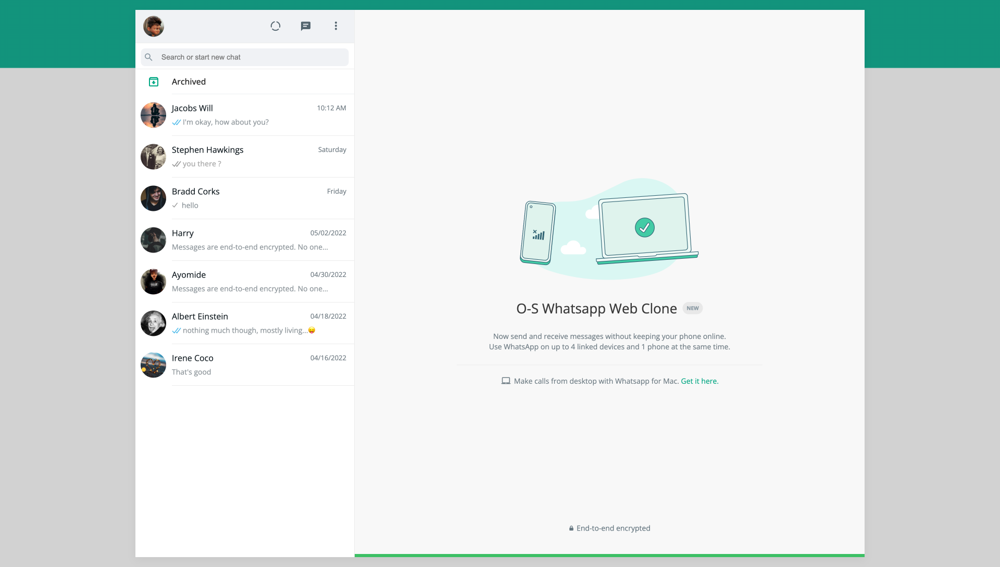
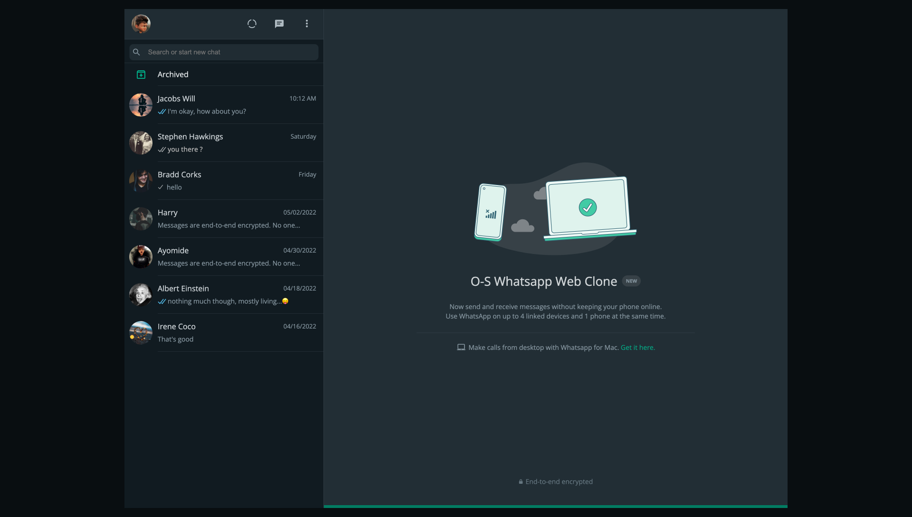
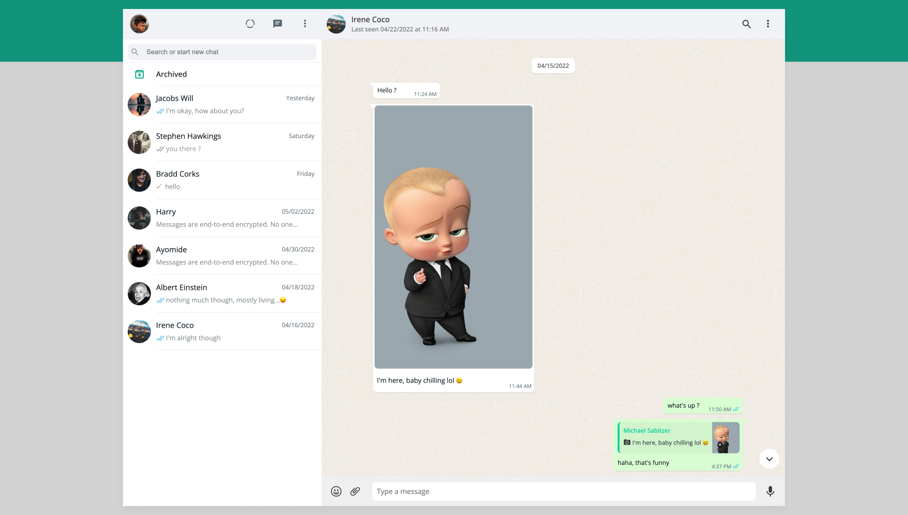
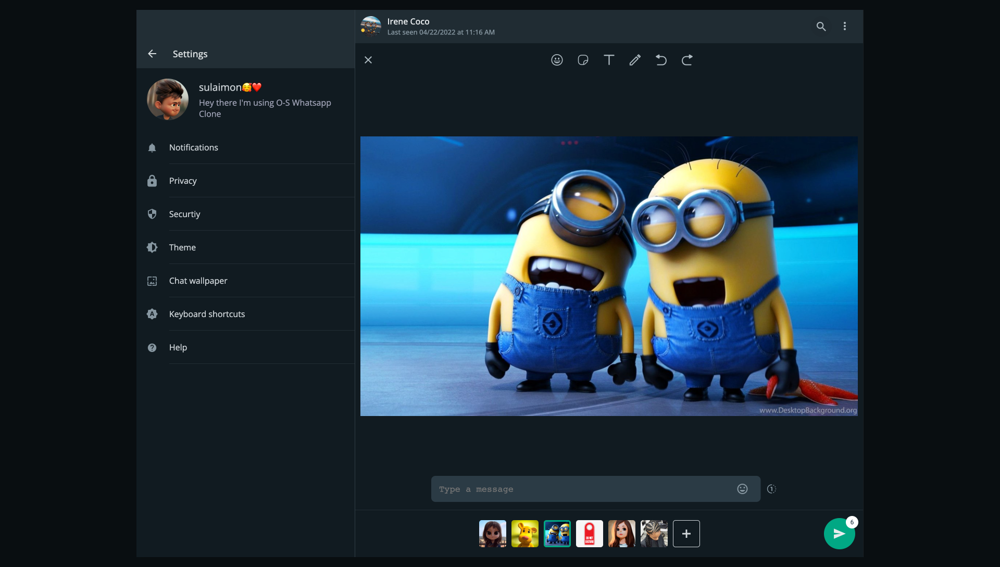
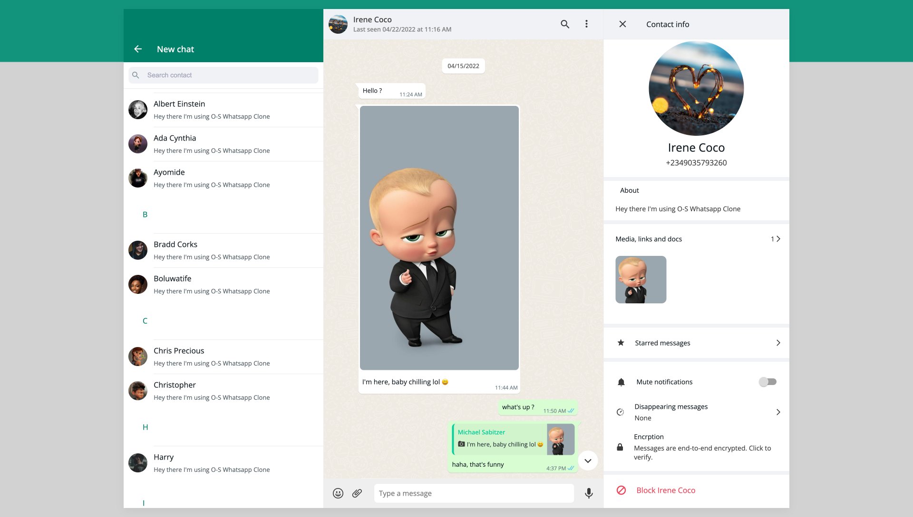
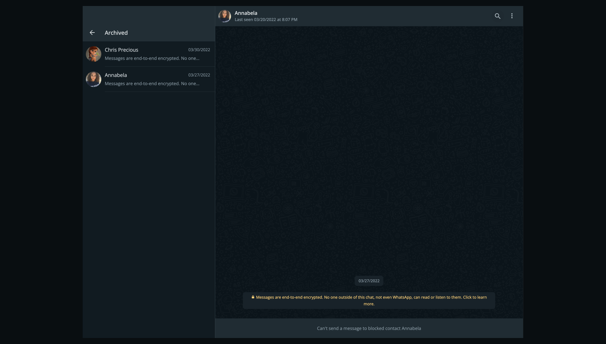
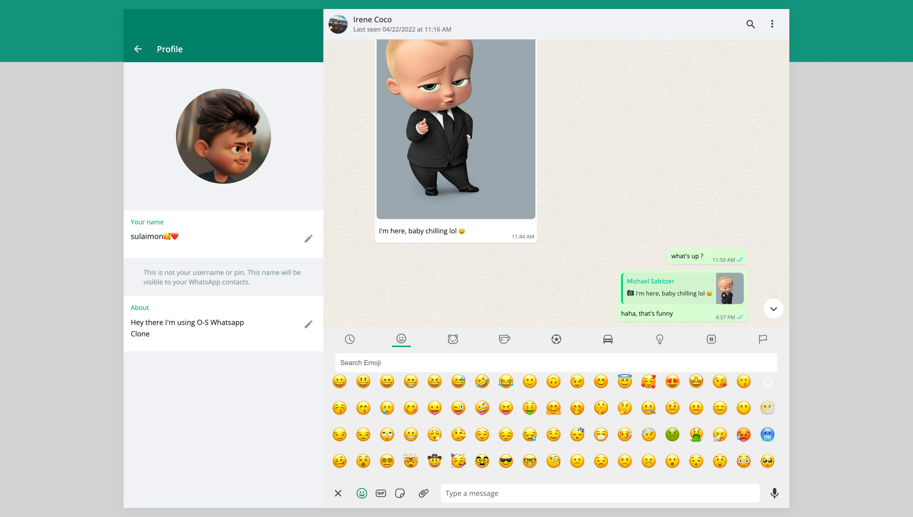
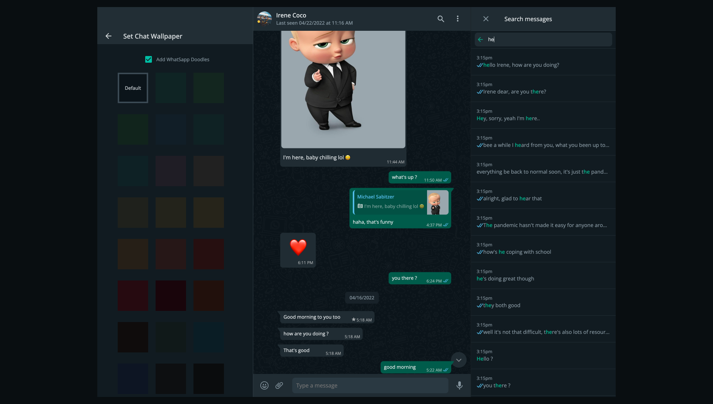

# OS-WhatsApp-Clone

## 🚪 Introduction

This is a clone of the popular messager Web Application WhatsApp. It provides similar functions but not all of the functions of the original Application.

---

## 👨‍💻 Technologies

### Front End

- React 17.8.2
- Node Sass 7.0.1
- Redux 4.1.2
- Axios 0.25.0
- Formik 2.2.9
- Yup 0.32.11
- UUID 8.3.2
- Use-debounce 7.0.1
- React-cropper 2.1.8
- React-highlight-words 0.18.0
- Material-ui 5.3.1
- React-Router-dom 6.2.1
- Moment 2.29.1
- React-phone-number-input 3.1.44

### Back End

- Node
- Express 4.17.2
- Puhser 5.0.1
- DOTENV 14.3.0
- JsonWebToken 8.5.1
- CORS 2.8.5
- Moment 2.29.1
- Mongoose 6.1.8
- Bcryptjs 2.4.3

---

## 🧐 Features

- Authentication (Creating new accounts and signing in to old accounts)

- Sending messages such as texts, images, stickers, gifs, documents and sharing Users(contacts)

- Deleting messages for you or for everyone(if message sent time haven't exceeded 5 minutes)

- Staring and replying to messages

- Message status (sending, sent, delivered, failed, and seen)

- User's presence (online, last seen)

- Blocking user(contact), user won't be able to send messages to you and you won't be albe to interact with user

- Updating profile information (profile picture, username and about) and user's privacty settings

- Creating and Deleting chats

- Archiving and pinning chats

- Clearing chat messages

---

## 🛠️ Setting up Development Enviroment

### Clone and Install

    git clone git@github.com:taniarascia/takenote

### Open two terminals, one for the client, other for the server

**Set up client/front end side -**

    cd client #from main directory
    npm install #to install install dependencies

**Set up server/back end side -**

    cd server #from main directory
    npm install #to install install dependencies

when installation is completed, you'd create an `.env` file, and check the `.env.example` file to see the variables that needs to be in your newly created `.env` file.

## Launch App

First launch the server side, so;

    cd server #from main directory
    npm start

server should be running on http://localhost:5000/

Then, lauch the client side

    cd client #from main directory
    npm start

Go to http://localhost:3000/ to see the app live

---

## 💡 Reflection

This was a personall project built trying to ehnacne my knowledge with building a full-stack application from scratch using React.JS and Node.JS. Originally I wantted to build a simple messenging app where users can just send messages and receive messages, then I thought to myself, why not a WhatsApp clone then.

At first, I thought it was going to be a simple build that I could complete under a month or two because obviously the WhatsApp web app is a one pager application. But, then I got the realise there were alot of functionalities happening behind the scenes.

Building the app helped enhanced my designing skills, also increase my knowledge with Redux and Express Js, it also helped me discover some new technologies such React Cropper and React Highlight Words.

One of the main challenges I ran into was database structure, if I was to build the app from scratch again I'd probably structure the database in a different way, one of the differences I'll make will be make each user in the database have a seperate message document. Right now both interlocutors share the same document so I have to use an array to store a user that had a mad a request, such as deleted the message.

At the end of the day, the major technologies implemented in this project are React, React-Router, Redux, SCSS, Material-UI, Formik, Yup, Node, Express, MongoDB, Mongoose, axios, moment, bcryptjs, pusher, pusher.js and jsonwebtoken.

---

## 📸 Screenshots

